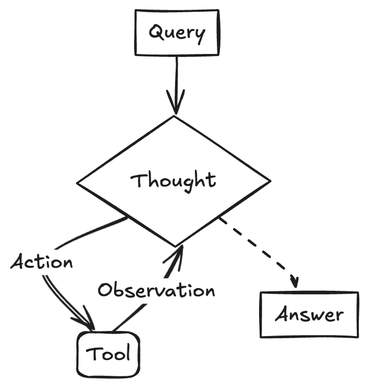

随着大模型的能力越来越强，各种智能助手也在持续涌现，在计算机领域本身，SRE的工作也面临挑战，如何通过AI来优化SRE工作效率，提高系统SLA，也是业界在探索的重点领域之一。本文介绍的HolmesGPT便是其中典型的一款SREAgent

## HolmesGPT 介绍

以A应用页面打开慢为例，从告警通知起始 **步骤2** 至 根因定位 **步骤11** SRE需要登录到各种系统中进行排查、分析、处理。


此时，不难想到一个需求
:::note
能否基于现有的监控系统、环境信息实现根因分析并提供最终解决方案？
:::

__程序员同学，可能会思考：采用运维自动化的方案即可，为何会需要采用大模型？ 在当前AI时代，好问题不怕得不到解答，Gemini Pro 提供了一个很好的答复，[附录：AIOps对比自动化运维](#附录：AIOps对比自动化运维)__

回归HolmesGPT，该作者正是通过以LLM构建的大脑和神经系统以及以可观测、云基础设施、IT服务化流程构建的骨骼和肌肉打造的AI运维助手。

## HolmesGPT 系统架构

HolmesGPT的核心目标为帮助SRE处理核心工作 —— **事件响应**，比如故障处理、业务诉求反馈、系统巡检，核心架构如下


1. 事件源头（两种形式），一种为系统触发，比如告警、定时任务、上游系统等等，另一种以自然语言触发，如研发诉求、用户反馈，即HolmesGPT的输入源头；
2. 事件上下文，依赖两类信息
    - 此时此刻：系统现状（所处环境信息及系统自身信息），通过API访问直接与系统交互获取；
    - 彼时彼刻：可观测信息（监控、日志、APM、事件），通过可观测系统保留的事件历史信息快照，记录了事件发生时的状态；
3. 聪明的“大脑”替代SRE工程师，实现自主规划、调用工具、并根据环境反馈来动态调整的“思考”能力；
4. 事件处理SOP，通过Confluence/Internet提供事件处理经验；
5. 事件输出，综合1-4最终形成RCA并输出最终结论。

## 核心技术点

### Agent的方法论



**ReAct (Reason and Act):** HolmesGPT采用当前最主流的 Agent 设计模式之一。它将任务分解为 **Thought -> Action -> Observation** 的循环。
    *   **Thought:** LLM 根据当前目标和历史信息，进行 "内心独白"，分析情况并决定下一步做什么。
    *   **Action:** 调用一个外部工具（如代码解释器、搜索引擎 API、数据库查询等）。
    *   **Observation:** 获取工具返回的结果。
    *   这个循环不断重复，直到任务完成。这种模式让 Agent 的行为变得可解释和可控。

整个反馈链路通过如下3个核心逻辑串联

1. holmes/core/tool_calling_llm.py - 最核心的LLM调用引擎
    - ToolCallingLLM类负责与LLM进行多轮交互
    - 管理工具调用、上下文窗口截断、成本跟踪
    - 实现call()方法的主要循环逻辑
2. holmes/main.py - CLI入口点
    - 所有命令的路由和参数解析
    - ask()命令是交互式查询的入口
    - investigate子命令处理各种告警源（AlertManager、Jira等）
3. holmes/core/investigation.py - 问题调查核心流程
    - investigate_issues()函数协调整个调查过程
    - 集成runbook管理、配置加载、结果处理

具体核心逻辑位置：
- 主循环: holmes/core/tool_calling_llm.py:343-495 (ToolCallingLLM.call方法)
- CLI处理: holmes/main.py:166-350 (ask命令)
- 调查流程: holmes/core/investigation.py:23-76 (investigate_issues函数)


### 提示词工程

HolmesGPT的提示词工程有以下亮点：

1. 模块化设计架构

- Jinja2模板系统：使用进行模块化组装
- 动态上下文注入：自动添加时间戳、集群名称等环境变量
- 分层结构：系统级(_general_instructions.jinja2) + 场景级(generic_ask.jinja2)

2. 强制性任务管理系统

- TodoWrite集成：在investigation_procedure.jinja2:54-65强制使用任务管理
- 多阶段调查流程：Phase 1 → Phase 2 → Final Review的递进式调查
- 依赖关系分析：区分独立任务和依赖任务，实现并行执行

3. 调查方法论内置

- "五个为什么"方法：在_general_instructions.jinja2:13要求深挖根因
- 多层验证机制：要求同时检查资源状态和应用运行时
- 证据追溯：要求所有结论都有具体工具输出支撑

4. 工具调用优化策略

- 批量调用：generic_ask.jinja2:3要求同时调用多个工具
- 上下文复用：限制每个工具最多5次调用，促进智能使用
- 错误处理：区分调查错误vs工具权限错误

5. 输出格式标准化

- 结构化输出：支持JSON和Markdown双格式
- 样式指南：具体的格式要求(代码块、斜体强调等)
- 简洁性原则：generic_ask.jinja2:21-24要求"painfully concise"

6. 动态工具集成配置

- 实时状态检测：_toolsets_instructions.jinja2动态显示可用/禁用的工具集
- 失败处理：详细的工具集配置失败处理指导
- 文档链接：自动提供相关配置文档URL

该提示词系统的核心优势是将复杂的DevOps调查流程标准化为可重复、可验证的结构化过程。

### 可扩展的接口能力

1. 插件系统架构

Toolset插件 - 参考现有的toolset系统：
```
# holmes/plugins/toolsets/your-service.yaml
name: "Your Service Integration"
tools:
- name: "query_data"
    description: "Query data from your service"
    type: "python_function"
    module: "holmes.plugins.toolsets.your_service"
    function: "query_data"
```

动态加载机制：
- holmes/core/toolset_manager.py 负责动态发现和加载toolsets
- 支持自定义toolset配置覆盖默认行为

2. 配置驱动的扩展

用户配置文件 (~/.holmes/config.yaml)：
```YAML
custom_toolsets:
your-service:
    enabled: true
    config:
    api_url: "https://your-api.com"
    auth_token: "${YOUR_SERVICE_TOKEN}"
```
3. MCP (Model Context Protocol) 支持

HolmesGPT已支持MCP toolsets，可以通过标准协议集成外部服务：
```YAML
toolsets:
mcp-server:
    type: "mcp"
    url: "your-mcp-server-url"
    enabled: true
```

4. API网关模式

创建统一的API层来聚合多个数据源：
- 实现标准的REST/GraphQL接口
- 支持认证、限流、缓存等横切关注点
- 通过配置文件管理不同环境的接入点

5. 事件驱动架构

Webhook集成：
```python
# 扩展holmes/plugins/sources/
class YourServiceSource:
    def get_alerts(self):
        # 实现获取告警的逻辑
        pass

    def enrich_alert(self, alert):
        # 实现告警信息增强
        pass
```

### 更安全的Tool Use

1. 现有安全机制

只读设计原则：
- 所有工具默认为只读访问
- 不允许修改系统状态或数据

`Bash工具安全验证 (holmes/core/tools.py):`
# 危险命令黑名单验证
`DANGEROUS_COMMANDS = ['rm', 'dd', 'mkfs', 'format', ...]`
# 执行前进行安全检查

2. 增强安全策略

  工具权限分级：
```yaml
# toolsets配置中添加权限级别
tools:
- name: "kubectl_get"
    permission_level: "read"
    allowed_namespaces: ["monitoring", "logging"]
- name: "kubectl_describe"
    permission_level: "inspect"
    rate_limit: 10  # 每分钟最多10次调用
```

  上下文感知的权限控制：
```python
class SecurityContext:
    def __init__(self, user_role, environment, investigation_scope):
        self.user_role = user_role
        self.environment = environment  # dev/staging/prod
        self.scope = investigation_scope

    def can_execute_tool(self, tool_name, parameters):
        # 基于上下文检查工具执行权限
        if self.environment == "prod" and tool_name in HIGH_RISK_TOOLS:
            return False
        return True
```

3. 输入验证和清理

参数验证：
```python
def validate_kubectl_command(namespace, resource_type, resource_name):
    # 验证namespace格式
    if not re.match(r'^[a-z0-9-]+$', namespace):
        raise SecurityError("Invalid namespace format")

    # 验证资源类型白名单
    if resource_type not in ALLOWED_RESOURCE_TYPES:
        raise SecurityError(f"Resource type {resource_type} not allowed")
```

  命令注入防护：
```python
def sanitize_bash_command(command):
    # 移除危险字符
    dangerous_chars = [';', '|', '&', '$', '`', '>', '<']
    for char in dangerous_chars:
        if char in command:
            raise SecurityError(f"Dangerous character '{char}' detected")
```

4. 审计和监控
工具执行审计：
```python
class ToolAuditLogger:
    def log_tool_execution(self, tool_name, parameters, result, user_context):
        audit_entry = {
            "timestamp": datetime.utcnow(),
            "tool": tool_name,
            "user": user_context.user_id,
            "parameters": self.sanitize_params(parameters),
            "success": result.success,
            "investigation_id": user_context.investigation_id
        }
        self.audit_store.save(audit_entry)
```

异常行为检测：
- 监控工具调用频率和模式
- 检测异常的参数组合
- 实时告警可疑活动

5. 沙箱隔离

容器化工具执行：
```
  def execute_in_sandbox(command, timeout=30):
      # 在受限容器中执行命令
      container_config = {
          "image": "holmes-sandbox",
          "network_mode": "none",  # 无网络访问
          "read_only": True,
          "memory_limit": "128m",
          "cpu_limit": "0.1"
      }
      return docker_client.run(container_config, command, timeout=timeout)
```

6. 配置驱动的安全策略

安全配置文件：
```yaml
# ~/.holmes/security.yaml
security_policies:
tool_restrictions:
    production:
    allowed_tools: ["kubectl_get", "prometheus_query"]
    forbidden_namespaces: ["kube-system"]
    development:
    allowed_tools: ["*"]

rate_limits:
    per_tool: 100  # 每小时
    per_investigation: 500

audit:
    enabled: true
    log_level: "detailed"
    retention_days: 90
```

7. 实现建议

参考现有的holmes/core/toolset_manager.py，扩展安全检查：
```python
class SecureToolsetManager(ToolsetManager):
    def __init__(self, security_config):
        super().__init__()
        self.security_validator = SecurityValidator(security_config)

    def execute_tool(self, tool_name, parameters, context):
        # 执行前安全检查
        self.security_validator.validate_execution(tool_name, parameters,
context)

        # 执行工具
        result = super().execute_tool(tool_name, parameters, context)

        # 执行后审计
        self.audit_logger.log_execution(tool_name, parameters, result,
context)

        return result
```
  这种多层次的安全机制确保了工具使用的安全性，同时保持了HolmesGPT的灵活性和可扩
  展性。

## 展望

全球最有名的两家AI创业公司OpenAI与Anthropic，OpenAI验证了LLM的可行性拉开了全新AI时代的序幕，Anthropic验证了AI编程的可行性让计算机软件行业发生了翻天复地的变化，也许很快变化将颠覆SRE的工作。

## 参考资料

* [什么是AIOps](https://info.support.huawei.com/info-finder/encyclopedia/zh/AIOps.html)
* [什么是可观测性2.0](https://greptime.cn/blogs/2025-04-24-observability2.0-greptimedb.html)


## 附录：AIOps对比自动化运维

:::note
以下内容对自动化运维代码与AI大模型在处理运维问题上的差异和协同关系进行了详细分析和探讨。
:::

这里的关键区别不在于"能"与"不能"，而在于处理问题的**复杂度边界**和**适应性**。自动化代码和 AI 大模型在这里扮演的角色，可以类比为一位严格执行手册的**初级工程师**和一位经验丰富、能触类旁通的**高级专家**。

### 自动化运维代码：处理"已知的未知"

您的自动化代码，本质上是一系列**基于规则的确定性系统**。它的逻辑是：

> **IF** `redis_hit_rate` < 50% **AND** `db_connections` > 1000 **THEN** `ALERT("疑似缓存穿透")` **AND** `EXECUTE("limit_api_rate.sh")`

这套系统极其高效、可靠，前提是：
1.  **你已经预知了这种故障模式**。
2.  **你已经为它编写了明确的规则和预案 (Playbook)**。

它非常擅长处理我们称之为 **"已知的未知"（Known Unknowns）** 的问题——我们知道可能会发生缓存穿透，只是不知道它何时发生。

**局限性在于：**
当出现一个**全新的、从未见过的故障组合**时，这套规则系统就失灵了。比如，某个 Kubernetes CNI 插件的 Bug，导致特定 Node 上的 Pod 网络出现微小的丢包，进而使 Trace 系统的数据上报不完整，最终体现为 APM 图表上出现无法解释的延迟毛刺。

您的自动化脚本里没有针对"CNI 丢包"和"Trace 数据不完整"的 `IF-ELSE`，它就无法将这两者与"延迟毛刺"关联起来，也就无法定位根因。

---

### AI 大模型：处理"未知的未知"

AI（特别是现代的机器学习和 LLM）是一个**基于概率和模式的学习系统**。它不依赖于人类预先编写的硬编码规则。

#### 1. 传统机器学习 (ML) 的价值：发现隐藏的关联

回到我之前提到的第一点"智能根因分析"。这部分其实更多是传统机器学习（时序分析、关联算法）的功劳。
*   **处理高维数据：** 一个现代应用有成千上万个指标。当故障发生时，可能有几十个指标同时异常。人类或简单的规则很难在这么多维度中快速找到根因。ML 算法可以瞬间分析所有指标的动态，计算它们的相关性，找出最可能是"第一张倒下的多米诺骨牌"的那个指标。
*   **动态基线：** 您的规则可能是 `IF P95 > 500ms`。但对于一个深夜低峰期的服务，`P95 = 200ms` 可能就已经是严重异常。AI 可以为每个指标学习其在不同时间（工作日、周末、大促）的"正常"动态范围，从而更精准地发现异常。

#### 2. 大语言模型 (LLM) 的独特价值：理解非结构化数据和推理

这是"为什么一定要用 AI **大模型**"这个问题的核心答案。LLM 带来了传统 ML 算法不具备的能力：

*   **理解自然语言：** 您的 SOP 中有"用户反馈"。LLM 可以实时读取工单、Slack/Teams 里的对话，**理解用户抱怨的"慢"、"卡"、"转圈圈"**，并将其与 APM 监控里的`LCP 指标升高`关联起来。这是自动化脚本无法做到的。
*   **解析日志和变更：** LLM 能读懂 Git 的 commit message、K8s 的变更 YAML 文件、以及应用打印出的非结构化日志。当故障发生时，它可以快速将时间点与这些"人类可读"的变更信息进行关联，直接告诉你：**"10:05 的延迟升高，与 9:50 的一个关于缓存策略的发布（commit #abc123）在时间上高度吻合。"**
*   **生成人类可读的报告：** 在找到根因后，LLM 可以自动生成一份像您 SOP 里那样的、清晰的故障摘要报告，发到 War Room 里，极大提升信息同步效率。

---

### 总结：协同工作的关系

把它们结合起来看：

*   **自动化运维代码：** 是 AIOps 的**骨骼和肌肉**，负责高效地执行明确的指令（扩容、回滚、重启）。
*   **AI 大模型：** 是 AIOps 的**大脑和神经系统**，负责感知（监控数据、日志、用户反馈）、分析（关联、定位）和决策（选择哪个预案）。

**AI 负责分析和决策，输出指令；自动化代码负责接收指令，并可靠地执行。**

所以，您完全不需要抛弃您宝贵的自动化代码。恰恰相反，AI 的加入，能让您的自动化代码变得更加"智能"，让它在面对复杂和未知的场景时，也能被精准地调用，从而实现真正的、有弹性的自动化运维。