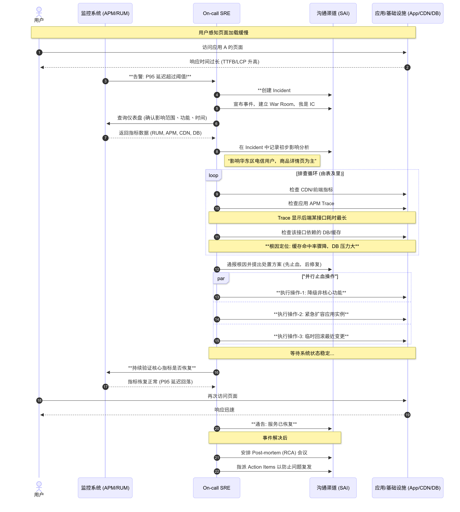
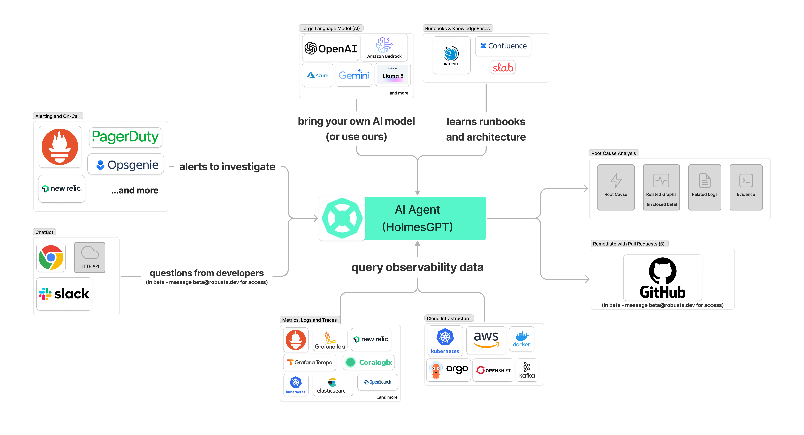

现如今大模型能力越来越强，DevOps以及SRE如何利用AI来提升运维效率，结合LLM能力的AIOps与传统运维可观测体系又有何异同，该如何结合？最近调研的一个运维智能体HolmesGPT(注：Holmes即著名的福尔摩斯侦探，该项目的雄心可见) 或许能提供一些见地。

## HolmesGPT 解决了什么问题？

以A应用页面打开慢为例，从告警通知起始 **步骤2** 至 根因定位 **步骤11** 全部都需要SRE登录到各种系统中进行人工排查、分析、处理。

此时，不难想到一个需求
:::note
能否实现自动的进行问题排查、判断并提供最终解决方案？
:::

## 参考资料

* [什么是AIOps](https://info.support.huawei.com/info-finder/encyclopedia/zh/AIOps.html)
* [什么是可观测性2.0](https://greptime.cn/blogs/2025-04-24-observability2.0-greptimedb.html)