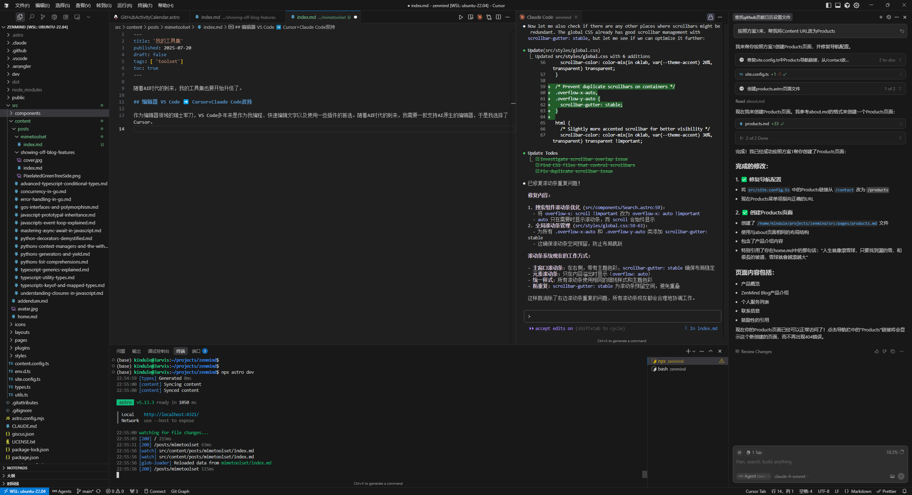

随着AI时代的到来，我的工具集也要开始升级。

## 编辑器: Cursor+Claude Code双持

作为编辑器领域的瑞士军刀，VS Code多年来是作为我编程、快速编辑文字以及使用一些插件的主力。随着AI时代的到来，我需要一款支持AI原生的编辑器，于是我选择了Cursor。随着Claude Code的发布，以及业界的推崇，我发现Claude Code的编程能力已经超越Cursor很多，但是Cursor在一些使用Tab Tab补全以及需要用到VS Code插件的场景中还是有些必要，因此决定采用Cursor+Claude Code双持的方案。

⬆️也可以看到，通过Cursor界面中安装Claude Code插件，可以将Claude Code集成到一起，这样也方便进行编程的BUFF叠加。

## 信息收集/头脑风暴：Sider/flomo
我尝试过一段时间使用 warp.dev 代替 Sider，但是发现无法完全替代，分析使用场景

1. 我会需要一些快速的对话，需要LLM帮我获取最新信息并总结的场景。
2. 需要快速对比不同大模型对于同一个问题的回答思路，来帮我认识问题的不同面向。
3. 需要设置不同角色，让大模型从我需要的角度来解释问题。

以上，Sider更符合该场景，所以还是决定继续使用Sider。

当我突然有一些一闪而过的思考时，我会使用flomo快速记录，当然也会回顾flomo中的内容进行方便后续进行清理。

## 阅读：微信读书&掌阅电子书

近年来发现的宝藏工具，**[微信读书](https://weread.qq.com/)**中的书籍真的非常丰富，当然有些没有上架微信读书的书籍，也会购买字纸书籍。电纸书各家都差不太多，Ocean 8的优势主要是它是市面上唯一的8寸屏幕电纸书。

## 梯子：LetsVPN

这个不说了，哈哈。

